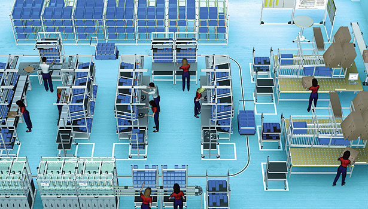
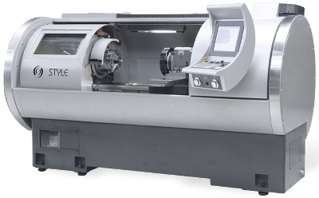
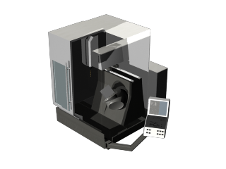
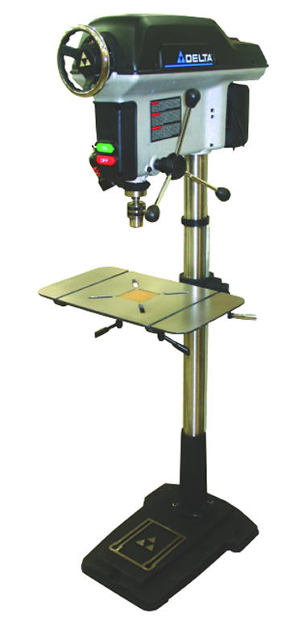

<h2>Contents</h2>
<ul>
<li><a href="#introduction">Introduction</a></li>
<li><a href="#problem">Problem Statement</a></li>
<li><a href="#math">Mathematical Model</a></li>
<li><a href="#applet">MIRO Applet</a></li>
<li><a href="#references">References</a></li>
</ul>

<h2> Introduction </h2> 

In the manufacturing field material handling is a necessary but costly activity. Increased material handling will create extra costs due to labor, machine and time requirements while possibly causing quality defects and increasing shop floor lead time. That is why often in practice the shop floor layouts are redesigned to minimize material handling related costs. Though making layout changes on the shop floor and moving machines also have associated costs. These costs are incurred since the production needs to be paused and labor hours are required to make the necessary changes to the layout. 

 This real life layout redesign decision can be modeled and solved as an optimization problem. The objective would be to minimize all costs including cost of making layout changes and cost of material handling. Figure 1 shows the general layout of any manufacturing facility  

Figure 1 :Layout  </img>

<a href="#top">Back to the top</a>

<h2> Problem Statement </h2> 

 A facility layout optimization model is presented that consists of four machines: CNC, Mill, Drill, and Punch. These machines are the most common machines in any manufacturing facility.

The pictures of the 4 machines are shown below:
 
CNC </img> 
Mill </img> 
Drill </img> 
Punch </img>

There are also a set of three products with pre-specified routings as shown below:

<ul>
<li>P1: Receiving -> CNC -> Drill -> Punch -> Shipping</li>
<li>P2: Receiving -> Mill -> Drill -> Punch -> Shipping</li>
<li>P3: Receiving -> CNC -> Drill -> Mill -> Punch -> Shipping</li>
</UL>

 The Objetive function, decision variables and constraints are presented below: 

<h3> <u> Objective Function and Decision Variables</u> </h3>

The objective function is to minimize the total cost of material handling and cost of layout changes. The material handling cost is calculated using Euclidean distances between the locations of work centers and the routing that needs to be followed by each product family times the cost associated for a unit of movement. The cost of changes in the layout is calculated by summing the cost associated with moving each machine over the set of machines that are moved. Cost of moving a machine is assumed to be \$300/distance and cost of material handling is \$100/distance

The decision of moving a machine or not is made and the new location of a machine is calculated by the optimization program. 

<h3> <u> Assumptions and Constraints </u></h3>

Lower left corner each machine is assumed to be the co-ordinates of the machine. The constraints as shown below:

<ol>
<li><b>Minimum Distance Constraint:</b>  In a manufacturing setting due to quality reasons, specific work centers should not be adjacent to one another. Thus a minimum distance between two work centers can be specified by the user and used as a constraint in redesigning the layout. </li>
<li><b>Location Constraint:</b> Each work center has a constraint for its location and movement in the floor space which is defined by rectangular region. </li>
</oL>

<a href="#top">Back to the top</a>

<h2> Mathematical Model </h2>
<h3><i><b> Sets:</b></i></h3>
<ul>
<li>$P:$ Set of products</li>
<li>$M:$ Set of machines</li>
<li>$S:$ Set of Shipping and Receiving </li>
<li>$N=M\cup S$ </li>
</ul>
<h3><i> <b>Parameters:</b></i></h3>
<ul>
    <li>$a_{p,n_1,n_2}:$ Binary variable representing routing of product $p$ between $n_1$ and $n_2$, $p \in P, n_1,n_2 \in N$</li>
<li>$xo_{n_1}:$ Initial x-coordinate of $n_1$, $n_1 \in N$</li>
<li>$yo_{n_1}:$ Initial y-coordinate of $n_1$, $n_1 \in N$</li>
<li>$CM_m:$ Cost of moving machine $m$ per unit distance, $m \in M$</li>
<li>$CH_p:$ Cost of material handling per unit distance for product $p$, $p \in P$</li>
<li>$MD_{m_1,m_2}:$ Minimum distance between machine $m_1$ and $m_2$, $m_1,m_2 \in M$</li>
<li>$c:$ Constant distance maintained between any machines</li>
<li>$x1_m:$ Lower x-coordinate for machine $m$ location, $m \in M$</li>
<li>$y1_m:$ Lower y-coordinate for machine $m$ location, $m \in M$</li>
<li>$x2_m:$ Upper x-coordinate for machine $m$ location, $m \in M$</li>
<li>$y2_m:$ Upper y-coordinate for machine $m$ location, $m \in M$</li>
</ul>

<h3><i> <b>Decision Variables:</b></i></h3>
<ul>
<li>$x_m:$ Final x-coordinate of machine $m$, $m \in M$</li>
<li>$y_m:$ Final y-coordinate of machine $m$, $m \in M$</li>
</ul>

<h3><i><b> Objective Function:</b></i></h3>

$$\begin{aligned}
TC = min\{\sum_{m \in M}CM_m\sqrt{(x_m-xo_m)^2+(y_m-yo_m)^2} + \sum_{p \in P} \sum_{n_1 \in N} \sum_{n_2 \in N}a_{p,n_1,n_2}CH_p\sqrt{(x_{n_1}-x_{n_2})^2+(y_{n_1}-y_{n_2})^2}\}
\end{aligned}$$

<h3><i><b> Shipping and Receiving Constraint:</b></i></h3>

$$\begin{aligned}
x_{s} &=& xo_s; \forall s \in S \\
y_{s} &=& yo_s; \forall s \in S \\
\end{aligned}$$

<h3><i> <b>Minimum Distance Constraint:</b></i></h3>

$$\begin{aligned}
\sqrt{(x_{m_1}-x_{m_2})^2+(y_{m_1}-y_{m_2})^2} \geq MD_{m_1,m_2} +c; \forall m_1,m_2 \in M, m_1 \neq m_2
\end{aligned}$$

<h3><i><b> Location Constraint:</b></i></h3>

$$\begin{aligned}
x_m &\geq& x1_m; \forall m \in M \\
y_m &\geq& y1_m; \forall m \in M \\
x_m &\leq& x2_m; \forall m \in M \\
y_m &\leq& y2_m; \forall m \in M \\
\end{aligned}$$

<a href="#top">Back to the top</a>

<h2> MIRO Applet </h2>

 The applet takes the inputs from the user and solves the mixed integer non-linear programing model (MINLP) using baron solver.

<h3><u> User Inputs </u> </h3>

<ul>
<li>Initial co-ordinates of each machine</li>
    <li>Costs of moving machines per unit of distance</li>
    <li>Costs of transporting products per unit of distance</li>
<li>Minimum distance between machines</li>
<li>Location constraint for a machine (based on the rectangular region)</li>
</ul>

<h3><u> Output </u></h3>

<ul>
    <li>Layout and Work flow: If the problem is infeasible, message indicating infeasibility will be displayed. If the problem is feasible , this output will show the initial and current optimized layout, work flow of each product shown on the graph. User can choose which flow to be displayed.</li>
    <li>Total cost of moving 3 products: This output shows the initial total cost of moving 3 products and the current optimized cost of moving products plus the cost of moving machine.</li>
</UL>

<h3>
    User Guide
</h3>

Inspite of those cost and location information, user can mainly change the "Minimum distance between machines" to get different results. With bigger value of this parameter, the layout would possibly be changed and the cost would possibly be higher. The Location constraint allows you to decide inside which area you may want to put those machines. So to some extent user can design the facility layout while minimizing the cost.

The GAMS model can be downloaded <a href='static_model/FacLoc.gms' target="_blank">here</a>

<applet archive="http://neos-dev-1.neos-server.org/guide/sites/default/files/SignedLayout_0.jar,http://neos-dev-1.neos-server.org/guide/sites/default/files/casestudies/Commons-logging-1.1.jar,http://neos-dev-1.neos-server.org/guide/sites/default/files/casestudies/Ws-commons-util-1.0.2.jar,http://neos-dev-1.neos-server.org/guide/sites/default/files/casestudies/Xmlrpc-client-3.1.3.jar,http://neos-dev-1.neos-server.org/guide/sites/default/files/casestudies/Xmlrpc-common-3.1.3.jar" code="mainGame.Starting" height="610" width="800"></applet>

<a href="#top">Back to the top</a>

<h2><b>References</b></h2>

 <oL><Li> Course ISYE 635 slides, Tools and Enviroments for Optimization,  Spring 2013 </li>
</ol>

<a href="#top">Back to the top</a>

