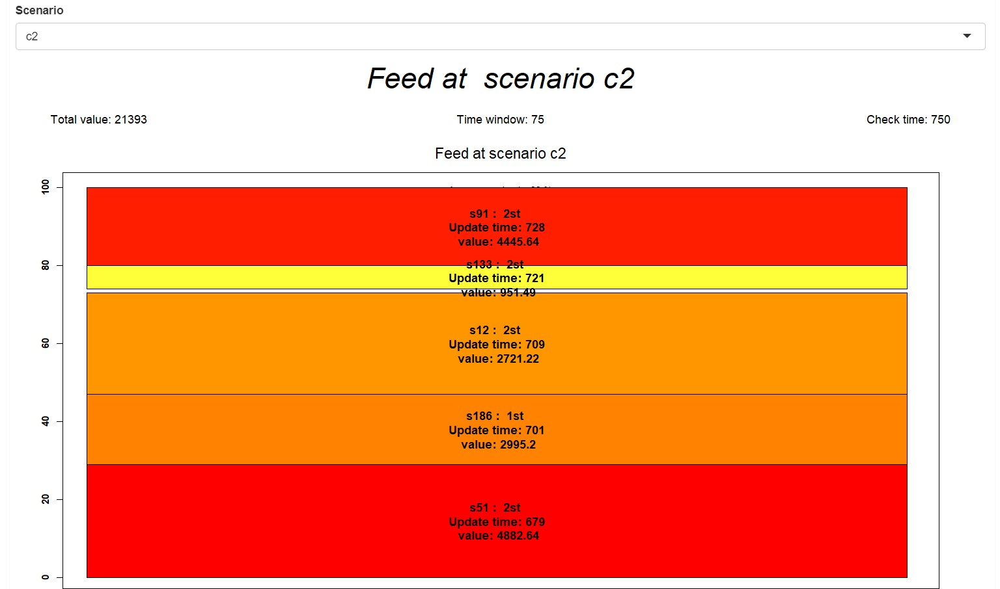

<a id='top'><h2>Introduction</h2></a>

Social sites and tablets present a <i>feed</i> of recent updates when an user logs in. These can be recent questions in the case of Quora, app updates in the case of Windows Surface etc. 
We consider each such update to be a <i>story</i>. Each story has a score depending on its relevance to the user, its commercial significance etc. The problem is to choose the best stories to be shown to the user subject to constraints like:
<ul>
<li>They should fit within the device display area.</li>
<li>They should be recent.</li>
<li>They should be relevant to the user etc.</li>
</ul>
We address this problem using an algebraic model. An applet is provided below to demonstrate the effectiveness of the algebraic model.  Sample real world two dimensional feed used in Windows Surface is shown in Figure 1.

<a href="#top">Back to the top</a>

<h2>Case Study Contents</h2>
<ul>
    <li><a href="#problem">Problem Statement</a></li>
    <li><a href='#model'>Input and Output</a></li>
<li><a href="#formulation">Mathematical Formulation</a></li>
<li><a href="#sample">Sample feeds</a></li>
    <li><a href="#GAMS">Embeding GAMS model</a></li>
<li><a href="#references">Acknowledgments</a></li>
</ul>

<h2>Problem Statement</h2>

We will present more concrete details on the input and output parameters of the model. A key assumption is that the stories are already assigned a score based on their type and relevance to user. Score assignment is another interesting but orthogonal problem.
<a id='model'><h3> Input Parameters </h3></a>

The input parameters for the model consist of :

<ul>
<li>A set of stories, their respective scores and time at which they are available.</li>
<li>Device display dimensions - height and width.</li>
<li>Temporal window of freshness to ensure only recent stories can be chosen.</li>
<li>Time at which the feed is retrieved.</li>
<li>Feed dimensions (1/2). </li>
<li>Ratio of <i>sponsored</i> stories to be displayed in the feed. </li>
</ul>

<h3> Stochastic model </h3>

We clearly need to <i>quickly</i> generate the feed of most relevant as well as recent stories whenever the user reloads their home page to access the feed. We model the <i>feed reloading</i> behavior to take into consideration the stories viewed by the user in the first stage.
So, the stochastic model considers <i>all scenarios</i> to pick the stories chosen in the first stage and then the stories chosen in the second stage are based on the scenario that is observed.

<ul>
<li>A set of scenarios, wherein each story has varying value in different scenarios. </li>
<li>Maximum time for the solver to choose the stories in the feed. </li>
</ul>
<h3>Output result </h3>

The output  displays the feed result, with given the layout of interface at all scenarios, information about the chosen story including its name, score, available time and story type. There are also information about the total value, area covered ratio of the interface, the time feed is retrieved , and the time windows. 

The feed displayed is primarily comprised of <i>rectangular tiles</i> that represent the stories. It represents the feed obtained in a <i>specific scenario</i> in the <i>second stage</i>. Each tile is associated with a color according to the value the story contributes. To be more clear, see the <a href='#sample'>sample feeds</a>.

<a href="#top">Back to the top</a>

<a id="formulation"><h2>Mathematical Formulation</h2></a>

The problem can be formulated mathematically as a mixed integer programming (MIP) as shown below.

<b>Sets</b> 
S = Set of stories available within the time window 
$C$ = Set of scenarios to model user behavior

<b>Parameters</b> 
$H$ = height of device display area,
$W$ = width of device display area,
$h_{s}$ = height of story $s$, $\forall s \in S$ 
$w_{s}$ = width of story $s$, $\forall s \in S$ 
$v_{s}$ = value of story $s$, $\forall s \in S$ 
$t_{s}$ = time when story $s$ is available, $\forall s \in S$ 
$p_{c}$ = probability of occurrence of scenario $c$, $\forall c \in C$  
$v_{sc}$ = value of story $s$ in scenario $c$, $\forall s \in S, \forall c \in C $ 
$sp_{s}$ = whether story $s$ is sponsored or not, $\forall s \in S, sp_{s} \in \{0, 1\} $ 
$\alpha$ = maximum fraction of sponsored stories, $ \alpha \in [0,1] $ 
$\beta$ = minimum fraction of stories chosen in first stage, $ \beta \in [0,1] $ 

We set the value of $v_{s}$ to follow an exponential decay pattern thus :
\begin{eqnarray*}
v_{s} = c_{s}.e^{(1+ \frac{t_{s} - t_{checkAt}}{t_{total}})}
\end{eqnarray*}
where, $c_{s}$ is a parameter following an uniform distribution.

We consider only stories that are recent i.e. which satisfy the constraints  :
\begin{eqnarray*}
t_{s} \leq t_{checkAt} \\
t_{s} \geq t_{checkAt}-t_{window} \\ 
\end{eqnarray*}

<b>Variables</b> 
$z_{s}$ = whether story $s$ is chosen in first stage or not, $\forall s \in S $ 
$zc_{sc}$ = whether story $s$ is chosen in second stage as part of scenario $c$ or not, $\forall s \in S, 
\forall c \in C$  
$x_{sc}$ = x coordinate of story $s$  in scenario $c$, $\forall s \in S, \forall c \in C$  
$y_{sc}$ = y coordinate of story $s$  in scenario $c$, $\forall s \in S, \forall c \in C$  
$check_{stc}$ = whether stories $s$  and $t$ need to be checked for <i>overlap</i> in scenario 
${c}$ or not, $\forall s \in S, \forall c \in C$  
$left_{stc}$ = whether story $s$ is on left of story $t$ in scenario ${c}$ or not, $\forall s \in S, \forall c \in C$  
$top_{stc}$ = whether story $s$ is on top of story $t$ in scenario ${c}$ or not, $\forall s \in S, \forall c \in C$  

<b>Objective Function</b>: 
\begin{align}
    & \mbox{Max} \sum_{s} z_{s}.v_{s} + \sum_{c} p_{c}. \sum_{s} zc_{sc}.v_{sc} & \forall s \in S, \forall c \in C \\ 
\end{align}

<b>Constraint Set 1</b>:  Positive variables.  
\begin{align}
x_{sc} \geq 0 & \forall s \in S, \forall c \in C \\
y_{sc} \geq 0 & \forall s \in S, \forall c \in C \\
\end{align}

<b>Constraint Set 2</b>:  Binary decision variables.  
\begin{align}
z_{s} \in \{0,1\} & \forall s \in S, \forall c \in C \\
zc_{sc} \in \{0,1\} & \forall s \in S, \forall c \in C \\
check_{stc} \in \{0,1\} & \forall s \in S, \forall t \in S ,\forall c \in C \\
left_{stc} \in \{0,1\} & \forall s \in S, \forall t \in S, \forall c \in C \\
top_{stc} \in \{0,1\} & \forall s \in S, \forall t \in S, \forall c \in C \\
\end{align}

<b>Constraint Set 3</b>: A story already picked in the first stage cannot be chosen in the second stage.  
\begin{align}
z_{s} \Rightarrow \lnot zc_{sc} & \forall s \in S, \forall c \in C 
\end{align}

<b>Constraint Set 4</b>: We need to check stories only when they are picked together.  
\begin{align}
z_{s} + z_{t} + zc_{sc} + zc_{st} \leq check_{stc} + 1 \\ 
& \forall s \in S, \forall t \in S, \forall c \in C \\
\end{align}

<b>Constraint Set 5</b>: We need to disallow overlap among all picked stories.  
\begin{align}
left_{stc} + left_{tsc} + top_{stc} + top_{tsc} \geq check_{stc}  \\
& \forall s \in S, \forall t \in S, \forall c \in C \\
\end{align}

<b>Constraint Set 6</b>: Horizontal overlap (Origin at top-left).  
\begin{align}
left_{stc} \wedge check_{stc} \Rightarrow  x_{sc} + w_{s}  \leq x_{tc}  \\
x_{sc} + w_{s} \leq W \\
& \forall s \in S, \forall t \in S, \forall c \in C \\
\end{align}

<b>Constraint Set 7</b>: Vertical overlap.  
\begin{align}
top_{stc} \wedge check_{stc}  \Rightarrow  y_{sc} + h_{s}  \leq y_{tc}  \\  
y_{sc} + h_{s} \leq H \\
& \forall s \in S, \forall t \in S, \forall c \in C \\
\end{align}

<b>Constraint Set 8</b>: Temporal order along horizontal axis.  
\begin{align}
left_{stc} \Rightarrow  t_{s} \geq t_{t}  
& \forall s \in S, \forall t \in S, \forall c \in C \\
\end{align}

<b>Constraint Set 9</b>: Temporal order along vertical axis.  
\begin{align}
top_{stc}  \Rightarrow t_{s} \geq t_{t} 
& \forall s \in S, \forall t \in S, \forall c \in C \\
\end{align}

<b>Constraint Set 10</b>: Sponsored stories must not exceed the $\alpha$ threshold.  
\begin{align}
\sum_{s : sp_{s} = 1 } z_{s} + zc_{sc} \leq \alpha .  (\sum_{s} z_{s} + zc_{sc})
& \forall s \in S, \forall t \in S, \forall c \in C \\
\end{align}

<b>Constraint Set 11</b>: A fraction of stories must be picked in the initial stage satisfying the $\beta$ threshold.  
\begin{align}
\sum_{s} z_{s} \geq \beta . (\sum_{c} p_{c}. \sum_{s} zc_{sc}) 
& \forall s \in S, \forall t \in S, \forall c \in C \\
\end{align}

 

To solve this MIP problem, we use the Gurobi solver from the NEOS Server.  We use a GAMS model to implement the model formulated above. 

<a href="#top">Back to the top</a>

<a id='sample'><h3> Sample feeds </h3></a>

<b> Base configuration </b>
We present feeds that are obtained for sample configurations to illustrate the effect of certain parameters. The base configuration results in a feed as shown in Figure 2a. We observe the feed value and fill area shown in the image. The feed presented is obtained in the <i>second stage</i> in all 3 scenarios. The retrieved time is 750 and the time windows is set to 75. It comprises of stories chosen in both the first and the second stage with their name, type ,available time and value information.. 

Figure 2a : Base configuration </img>

<b> Effect of time window </b>
When we decrease the time window, the optimal feed value decreases. This is shown in Figure 2b. We can observe the difference by comparing with Figure 2a - even when in some scenarios fill area is more, the optimal feed value is lower.

Figure 2b : decreasing time window  </img>

<b>Effect of Checkat time</b>

When we change the feed retrieved time from 750 to 500, the results changed like figure 2c:

Figure 2c : chenge feed retrieved time  </img>

<b> Two dimensional feed for 4 scenarios</b>
An illustrative two dimensional feed is shown in Figure 2d. Note that number of scenarios could be changed, and the layout will adapt automatically.

Figure 2d : 2-D Feed  </img>

<h3> High level observations </h3>

<ul>
<li> The solver converges to a pretty good approximate solution with low relative error $(~0.05)$ in about $10 sec$ for the input data set with 200 stories and 3 scenarios. This compares favorably to dynamic programming solutions for the problem.</li>
<li> Fill area is in general much higher for 1-D feeds ($\geq 80\%$) as compared to 2-D feeds.  </li>
<li> The stochastic model has a high relative value of stochastic solution. Modeling the user's behavior is therefore well worth the extra search cost involved. </li>
</ul> 

<a href="#top">Back to the top</a>

<a id='GAMS'><h2>
    Embedding GAMS model</h2></a>

<a href='static_feedoptimizer/feedoptimizer.gms' target='_blank'>GAMS model</a>

<a href="#top">Back to the top</a>

<a id="references"><h2> Acknowledgements </h2></a>

<ul>
<li> Quora Programming Challenge. http://www.quora.com/challenges </li>
<li> Xin Han, Kazuo Iwama, Deshi Ye, and Guochuan Zhang. Strip packing vs. bin packing. CoRR,
abs/cs/0607046, 2006. </li>
<li> Facebook. Activity Feed. http://developers.facebook.com/docs/reference/plugins/activity/, 2013. </li>
</ul>

<a href="#top">Back to the top</a>
