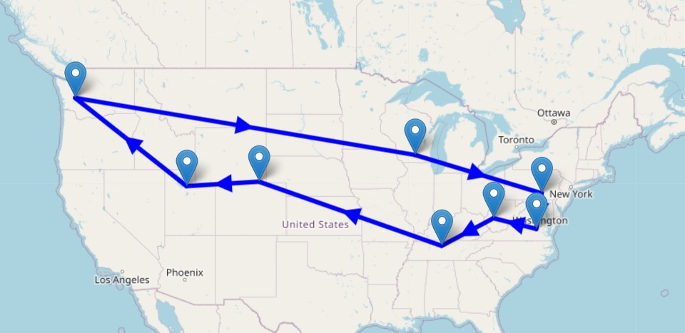

# Traveling Salesman Problem

## Problem Description
The TSP can be defined as follows: for a given list of cities and the distances between each pair of them, we want to find the shortest possible route that goes to each city once and returns to the origin city. Look at the below picture to see an simple example:

Figure 2b : example route through labeled cities </img>

There is a class of Traveling Salesman Problems that assumes that the distance of going from city $i$ to city $j$  is the same as going from city $j$ to city $i$: this type of Traveling Salesman Problem  is also known as the symmetric Traveling Salesman Problem. In this example, we use Spherical distances, but the TSP model formulation is valid independent of the way in which the individual distances are determined.

<h3>
    Input and Output illustration
</h3>

<h4>
    Input:
</h4>

There are two ways to solve the problem, one uses positional constraints and the other uses dynamic subtour elimination constraints.   This can be changed in the input widgets data (default is Dynamic SEC).

The user can also select the cities he/she may want to tour among the 50 capital cities in the U.S. The location information could also be modified (although the data is the real location coordinates.) 

<h4>
    Output:
</h4>

This gives the tour route (a Hamilton cycle) among the selected cities. The user can choose whether or not to display those cities not selected.

## Solution Approach

Mathematical programming is a declarative approach where the modeler formulates a mathematical optimization model that captures the key aspects of a complex decision problem. The Gurobi Optimizer solves such models using state-of-the-art mathematics and computer science.

A mathematical optimization model has five components, namely:

* Sets and indices.
* Parameters.
* Decision variables.
* Objective function(s).
* Constraints.

We now present a MIP formulation of the TSP that identifies the shortest route that goes to all the cities once and returns to the origin city.

## TSP Model Formulation

### Sets and Indices
$i, j \in Capitals $: indices and set of US capital cities.

$\text{Pairings}= \{(i,j) \in Capitals \times Capitals \}$: Set of allowed pairings

$S \subset Capitals$: A subset of the set of US capital cities.

$G = (Capitals, Pairings)$: A graph where the set $Capitals$ defines the set of nodes and the set $Pairings$ defines the set of edges. 

### Parameters 

$d_{i, j} \in \mathbb{R}^+$: Distance from capital city $i$ to capital city $j$, for all $(i, j) \in Pairings$. 

Notice that the distance from capital city $i$ to capital city $j$ is the same as the distance from capital city $j$ to capital city $i$, i.e. $d_{i, j} = d_{j, i}$. For this reason, this TSP is also called the symmetric Traveling Salesman Problem.

### Decision Variables
$x_{i, j} \in \{0, 1\}$: This variable is equal to 1, if we decide to connect city $i$ with city $j$. Otherwise, the decision variable is equal to zero.

<h3>Objective Function</h3>

- **Shortest Route**. Minimize the total distance of a route. A route is a sequence of capital cities where the salesperson visits each city only once and returns to the starting capital city.

$$\text{Min} \quad Z = \sum_{(i,j) \in \text{Pairings}}d_{i,j} \cdot x_{i,j}$$

### Constraints 
- **Entering a capital city**. For each capital city $i$, ensure that this city is connected to two other cities. 

$$\sum_{(j,i) \in \text{Pairings}}x_{i,j} = 1 \quad \forall  i \in Capitals$$
- **leaving a capital city**. For each capital city $i$, ensure that this city is connected to two other cities. 

$$\sum_{(i,j) \in \text{Pairings}}x_{i,j} = 1 \quad \forall  i \in Capitals$$

- **Position constraints**. Although not intuitive enough, these constraints ensure that for any subset of cities $S$ of the set of $Capitals$, there is no cycle. That is, there is no route that visits all the cities in the subset and returns to the origin city.

$$u_i+u_j+1\leq (n-1)(1-x_{ij}) \quad \forall  (i,j) \subset  S \quad and \quad i,j\neq 1$$
Here $u_i$ represent the position of city $i\ge 2$ in the Hamilton cycle.

- **Remark**. Subtour elimination constraints do precisely that - take out subtours.  The above constraints have the same function as subtour elimination constraints. Although more intuitive, 
since there are an exponential number of constraints ($2^{n} - 2$) to eliminate cycles,  it is difficult to deal with computationally, hence the dynamic approach that is coded. However, the position constraints which generally have $O(n^2)$ constraints, avoids generating subtours, but for larger instances can take much longer to solve.

<h3> 
    GAMS model
</h3>

The GAMS model can be download <a href="static_tspmod/tspmod.gms" target="_blank">here</a>.

